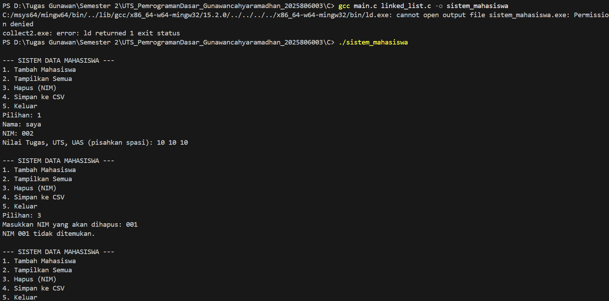
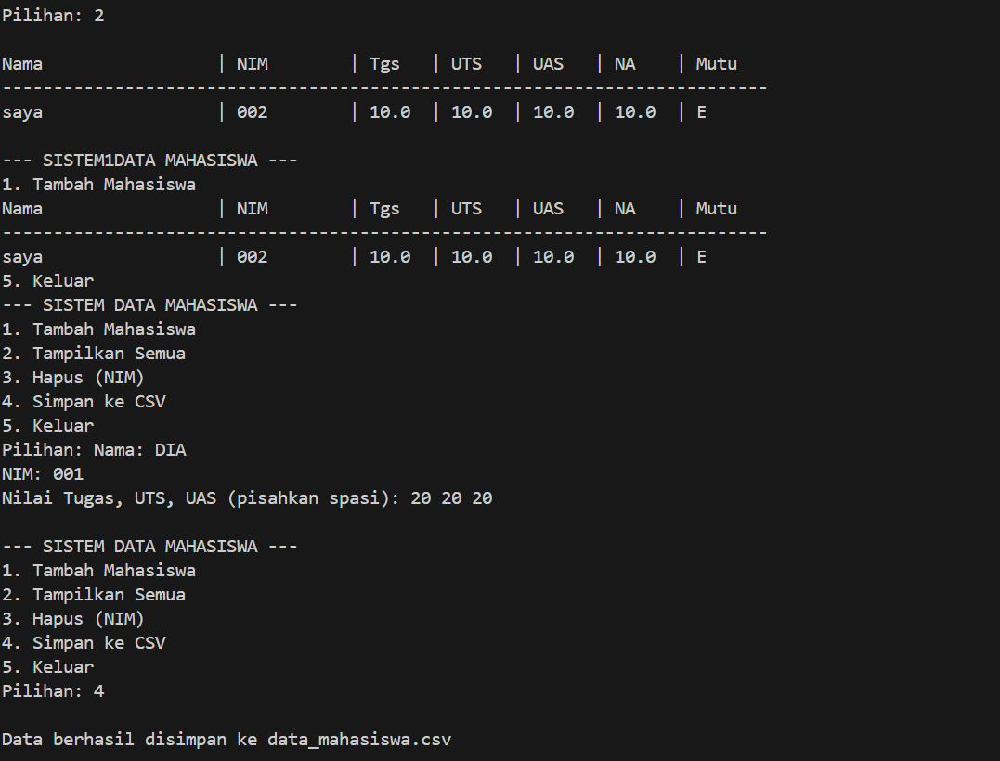

NAMA : GUNAWAN CAHYA RAMADHAN
NIM : 2025806003

1. main.c memanggil fungsi.

2. Compiler mengecek linked_list.h untuk memastikan fungsi itu ada dan cara pakainya benar.

3. Saat program berjalan, perintah dieksekusi berdasarkan kode yang ada di linked_list.c.

4. Hasil akhirnya bisa dilihat di layar atau di file data_mahasiswa.csv.

cd c (jika diperlukan)
cd soal1_data_mahasiswa (jika diperlukan)
gcc main.c linked_list.c -o sistem_mahasiswa
./sistem_mahasiswa