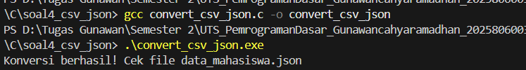
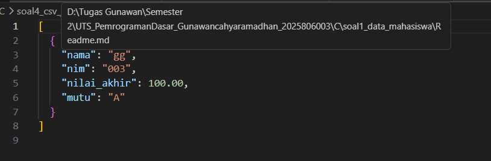

# Sistem Terintegrasi CSV ke JSON

Proyek ini mendemonstrasikan bagaimana data mahasiswa yang dikelola menggunakan 
**Linked List** di C dapat diekspor ke CSV dan dikonversi menjadi JSON.

## Cara Menjalankan
1. **Kompilasi Program Utama:**
   `gcc main.c linked_list.c -o sistem_mahasiswa`
2. **Jalankan & Simpan Data:**
   Eksekusi `./sistem_mahasiswa`, input data, dan pilih menu **Simpan ke CSV**.
3. **Konversi ke JSON:**
   `gcc convert_csv_json.c -o convert_csv_json`
   `.\convert_csv_json.exe`

## Format Output JSON
```json
[
  {
    "nama": "Rina",
    "nim": "2310001",
    "nilai_akhir": 85.50,
    "mutu": "A"
  }
]



