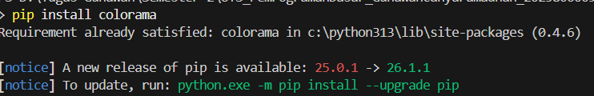
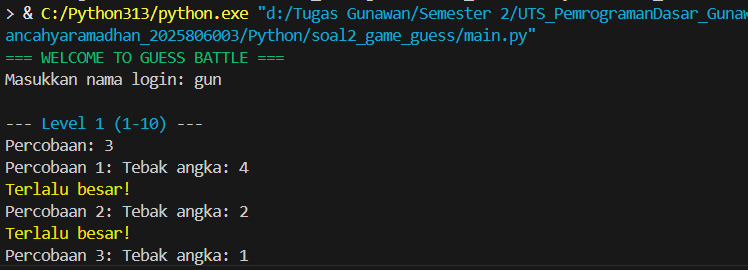
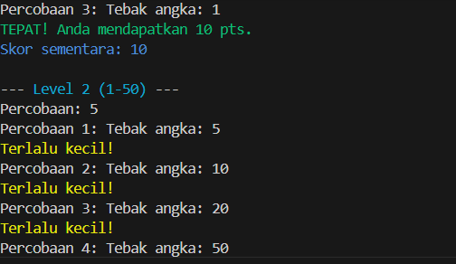

NAMA : GUNAWAN CAHYA RAMADHAN
NIM : 2025806003

Penjelasan Singkat
main.py: Berfungsi sebagai otak utama yang mengatur perpindahan dari Level 1 ke level berikutnya. Ia juga memanggil fungsi simpan skor setelah game berakhir.

game.py: Berisi aturan main. Di sini angka acak dibuat menggunakan random.randint(). Jika tebakanmu salah, ia memberi tahu apakah angka tersebut "Terlalu Besar" atau "Terlalu Kecil".

scoreboard.py: Mengelola file JSON. Ia bertugas membaca skor lama, menambah skor baru, dan mengurutkan pemain dari yang terpintar (skor tertinggi) ke terendah.

run python file

pip install colorama

run python file

python main.py

