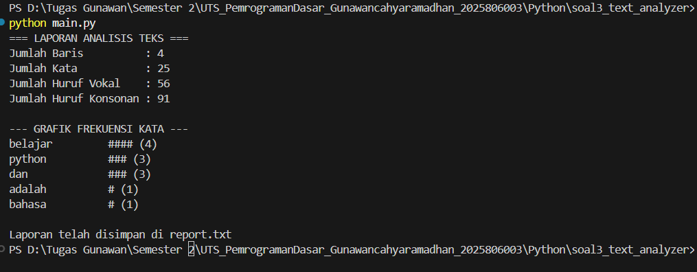
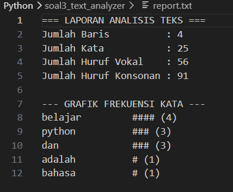

NAMA : GUNAWAN CAHYA RAMADHAN
NIM : 2025806003

main.py: Mengontrol alur masuk-keluar data. Ia membuka file input.txt, mengirim isinya untuk dianalisis, lalu mencetak hasilnya ke report.txt.

analyzer.py: Fokus pada frekuensi kata. Ia mencari 5 kata yang paling sering muncul dan mengubah angka tersebut menjadi grafik batang ASCII (seperti #####).

utils.py: Fokus pada detail karakter. Ia memeriksa setiap huruf dalam teks untuk menentukan apakah itu termasuk huruf vokal (a, e, i, o, u) atau konsonan.

CD Python
CD soal3_text_analyzer
python main.py

