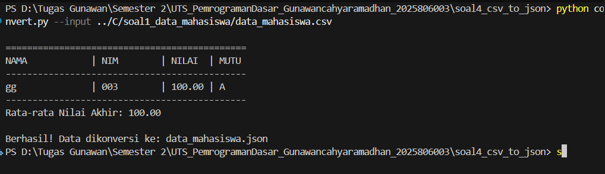

NAMA : GUNAWAN CAHYA RAMADHAN
NIM : 2025806003

Fungsi process_data: Membaca file CSV baris demi baris menggunakan csv.DictReader. Ini secara otomatis mengubah setiap kolom menjadi kunci (key) dalam kamus (dictionary) Python.

Manipulasi Data: Program melakukan casting (mengubah tipe data) dari teks ke angka (float) untuk menghitung rata-rata nilai seluruh mahasiswa.

Output JSON: Menggunakan modul json untuk menyimpan daftar mahasiswa ke dalam format yang terstruktur rapi dengan indentasi agar mudah dibaca.

Modularitas & CLI: Menggunakan argparse agar user bisa menentukan file mana yang mau dikonversi langsung dari terminal tanpa mengubah kode program.

